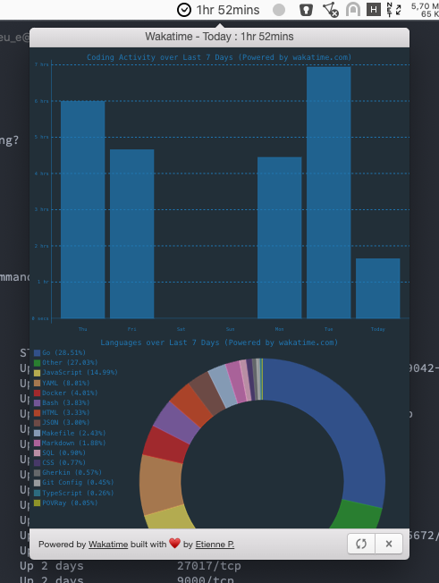

# Wakatime OSX Menu bar

A simple OSX menu bar app that just shows today's coding time from WakaTime and basic charts related to coding activity

- API key is read from the ~/.wakatime.cfg file automatically.

Built with [Photon](http://photonkit.com) and [Electron](http://electron.atom.io).

## Running

```sh
git clone https://github.com/EtiennePasteur/Waka-menu.git
cd Waka-menu
npm install
npm start
```

## Packaging

```sh
npm run package
open out/Wakamenu-darwin-x64/Wakamenu.app
```
## Preview

